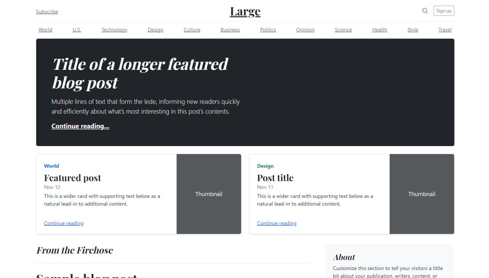
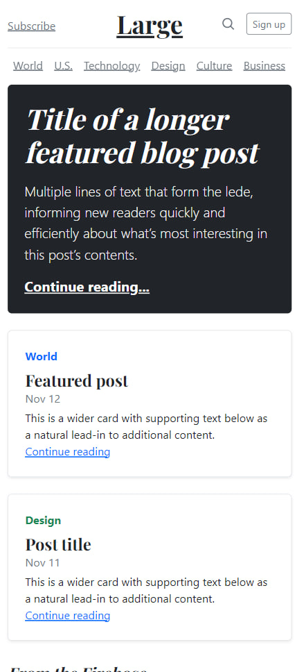

# Frontend-Bootstrap-Lessons 
My_Frontend || Blog || 2 - Lesson

## Screenshots
<table>
    <tr>
        <td>
            
        </td>
        <td>
            
        </td>
    </tr>
</table>

## Demo

[Live Demo](https://getbootstrap.com/docs/5.2/examples/blog/)

## Tech Stack

- HTML
- CSS
- Bootstrap5
- Responsive

## Authors

- [T.Oqilbek](https://www.github.com/tolqinov-o)

### Lesson - 2 Demo Link

```
https://getbootstrap.com/docs/5.2/examples/blog/
```